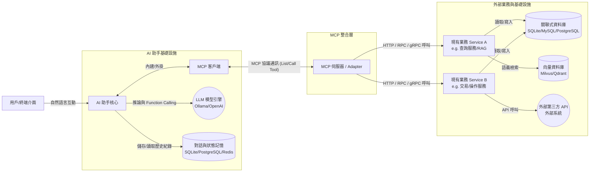

# AI 助手透過 MCP 整合現有服務之架構規劃

## 1. 核心設計理念 (Core Concept)
透過 Model Context Protocol (MCP) 標準化 AI 助手與現有後端系統的通訊。將現有的業務邏輯（Service）封裝為 MCP Server 上的 Tools (工具) 或 Resources (資源)，使 AI 助手能夠自主探索並呼叫這些能力，而無需在 AI 核心中硬編碼業務 API。

## 2. 系統架構圖 (Logical Architecture)

## 3. 關鍵組件說明 (Component Details)

### 3.1 用戶/終端介面 (User Interface)
*   **職責**：接收用戶的自然語言輸入（文字或語音），並展示 AI 助手的回應或執行結果。
*   **特性**：純展示層，不處理複雜業務邏輯。

### 3.2 AI 助手核心 (AI Assistant Core)
*   **職責**：
    *   理解用戶意圖 (NLU)。
    *   決定是否需要呼叫外部工具來完成任務。
    *   整合工具回傳的結果，生成最終的自然語言回覆。
*   **特性**：必須具備 Function Calling (函數呼叫) 或 Tool Use 的能力。
*   **外部依賴 (AI 核心基礎設施)**：
    *   **LLM 推論引擎 (LLM Engine)**：例如 **Ollama** (用於本地部署)、**vLLM**，或是雲端 API (OpenAI / Anthropic 等)，負責實際的語言理解與 Function Calling 決策。
    *   **記憶與狀態儲存 (Memory & State DB)**：例如 **SQLite/PostgreSQL** (用以永久儲存用戶 Profile、歷史對話) 或 **Redis** (用以管理短期對話 Session 快取)。
    *   **AI 應用開發框架 (可選)**：例如 LangChain, LlamaIndex 或 AutoGen 等，用於串接對話流程、管理 Prompt 模板並整合 MCP Client。

### 3.3 MCP 客戶端 (MCP Client)
*   **職責**：
    *   作為 AI 助手與 MCP 伺服器之間的橋樑。
    *   負責向 MCP Server 獲取可用工具清單 (List Tools / Resources)。
    *   負責發起具體的工具呼叫請求 (Call Tool)。

### 3.4 MCP 伺服器 (MCP Server)
*   **職責**：
    *   **適配器角色 (Adapter)**：將現有的後端 Service 方法，對外映射並描述為符合 MCP 規範的「工具 (Tools)」。
    *   **請求路由與轉換**：接收來自 MCP Client 的標準請求，轉換為對內部 Service 的實際方法呼叫或 API 請求。
    *   **上下文提供**：除了主動執行的工具外，也可以將靜態知識或文件作為「資源 (Resources)」提供給 AI 助手。

### 3.5 現有服務 (Existing Services)
*   **職責**：執行實際的核心業務邏輯、資料庫操作（例如您現有的業務邏輯 Service）。
*   **特性**：**無需修改現有的程式碼架構**。MCP Server 會負責將這些既有能力「包裝」出去。

## 4. 典型互動流程 (Interaction Flow)
1.  **能力發現 (Discovery)**：系統啟動或建立連線時，MCP Client 向 MCP Server 詢問：「你有提供哪些能力？」，MCP Server 回傳現有服務的工具清單與參數說明。
2.  **用戶觸發 (Trigger)**：用戶輸入問題或指令。
3.  **意圖判斷 (Decision)**：AI 助手判斷需要使用某個特定的外部工具。
4.  **發起呼叫 (Execution)**：AI 助手透過 MCP Client 傳送標準化的工具呼叫請求給 MCP Server。
5.  **業務執行 (Business Logic)**：MCP Server 解析該請求，並在內部呼叫對應的「現有服務 (Existing Service)」。
6.  **結果回傳 (Response)**：服務回傳處理結果，MCP Server 將其包裝為 MCP 標準格式回傳給 AI 助手。
7.  **最終生成 (Final Answer)**：AI 助手根據取得的業務資料，整理成自然語言回答給用戶。

## 5. 架構優勢 (Advantages)
*   **高解耦 (Decoupling)**：AI 應用程式與業務系統完全分離。業務系統不需知道 AI 的存在，只需專注於業務邏輯。
*   **極佳的擴展性 (Scalability)**：未來若要增加新的 Service 提供給 AI，只需在 MCP Server 上註冊新工具即可，AI 助手可立即「學會」新能力，無須修改 AI 核心。
*   **標準化防呆 (Standardization)**：遵循 MCP 協定，未來若要替換不同的 LLM 模型或 AI 框架，只要它們支援 MCP 協定，就能無縫接軌您的業務系統。
